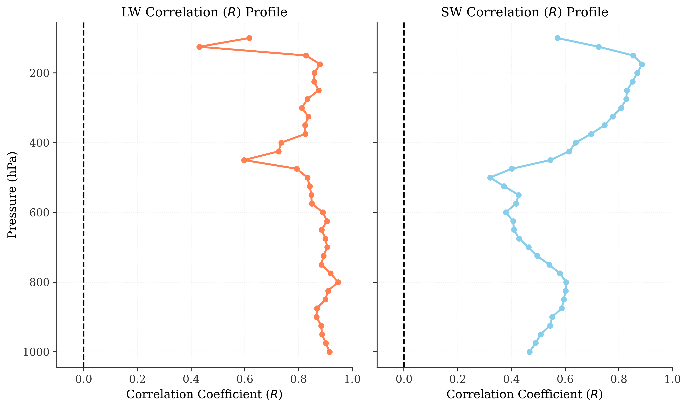
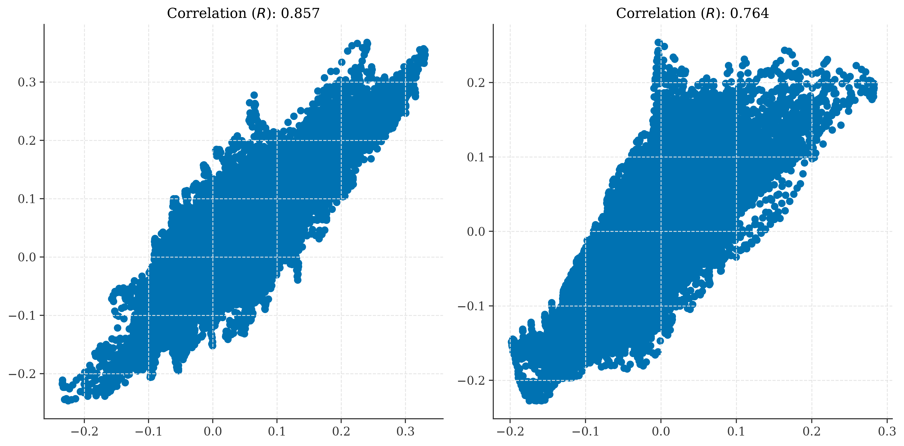
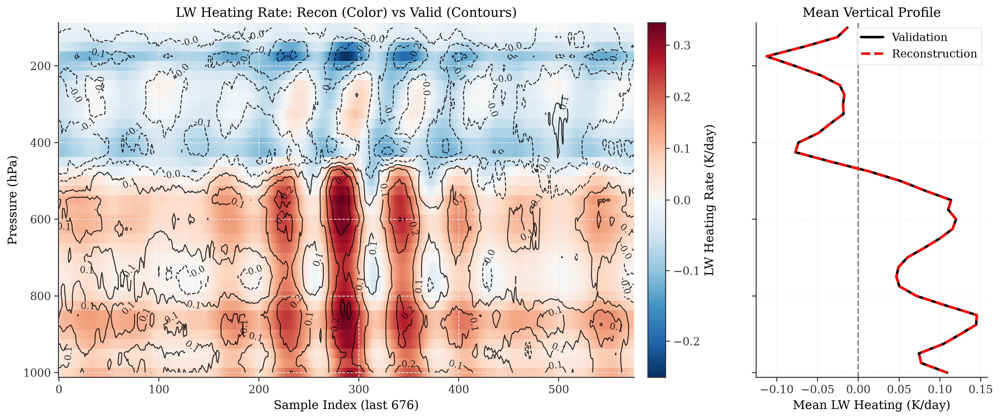
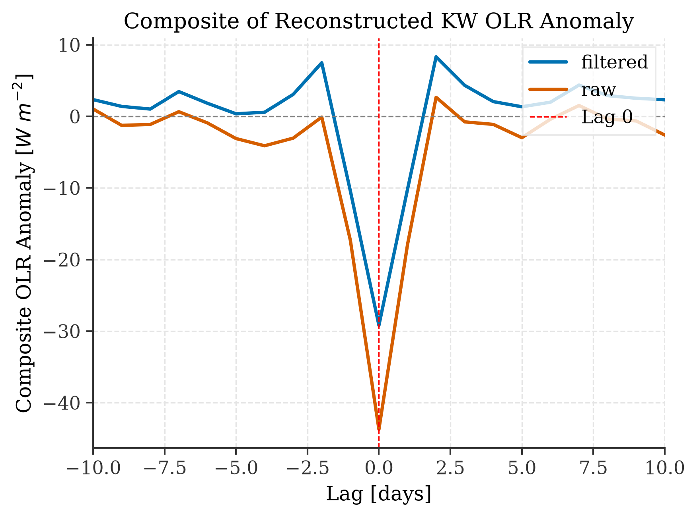
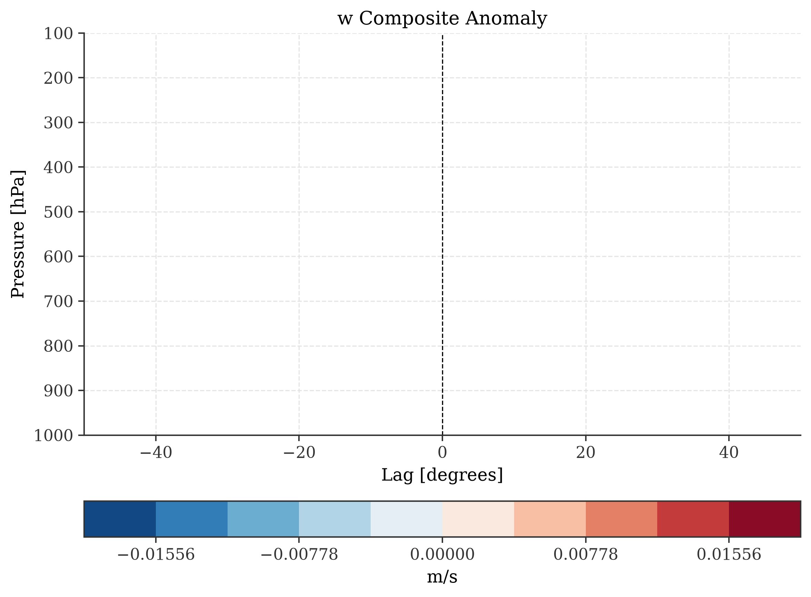
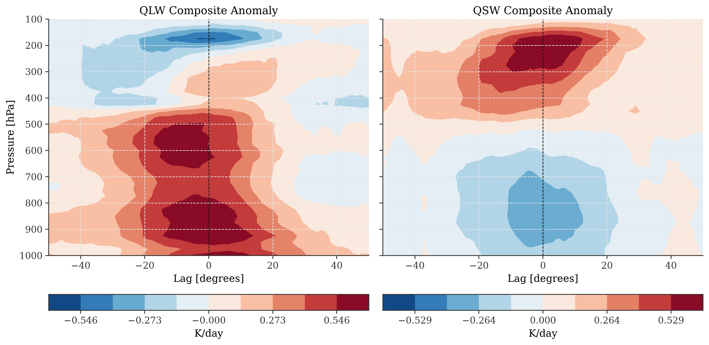

# KW_CloudSat: Kelvin Wave Radiative-Dynamic Coupling Analysis

This project investigates the radiative-dynamic coupling associated with equatorially trapped Kelvin Waves (KWs). By combining Satellite Outgoing Longwave Radiation (OLR), ERA5 Reanalysis kinematics, and CloudSat radiative heating profiles, we isolate KW events and extract the linear relationship between vertical motion ($w$) and radiative heating rates ($Q_{LW}$, $Q_{SW}$).

## 1. Datasets and Variables

The project synthesizes three major datasets over the period of 2006–2017 for the equatorial band (5°S–5°N).

*   **Satellite OLR Data:**
    *   **Variable:** Outgoing Longwave Radiation (OLR) Anomaly.
    *   **Purpose:** To filter and identify convectively coupled Kelvin wave events.
*   **ERA5 Reanalysis:**
    *   **Variables:** Pressure velocity ($\omega$) and Temperature ($T$).
    *   **Purpose:** To derive kinematic vertical velocity ($w$) and provide atmospheric dynamic context.
*   **CloudSat (Gridded):**
    *   **Variables:** Longwave Heating Rate ($Q_{LW}$) and Shortwave Heating Rate ($Q_{SW}$).
    *   **Purpose:** To provide vertical profiles of radiative heating rates associated with the KW events.

## 2. Methodology

The analysis is broken down into a four-step pipeline, implemented in the `Code/` directory:

### Step 1: Kelvin Wave Event Selection (`Code/KW_selection.py`)
*   **Filtering:** OLR data is symmetrized around the equator and passed through a Space-Time filter to isolate Kelvin waves (equivalent depth $h = 8-90$ m, period $T = 2.5-30$ days, varying wavenumber bands $k$).
*   **Event Identification:** A local minimum filter (7 days $\times$ 31 degrees footprint) is applied. Events are flagged where the filtered OLR reaches a local minimum and exceeds a significance threshold ($-2.77\sigma$).

### Step 2 & 3: Compositing Dynamics and Radiative Heating (`Code/ERA5_composite.py`, `Code/QR_composite.py`)
*   Using the indices identified in Step 1, we extract and composite the ERA5 thermodynamic fields and CloudSat radiative heating profiles.
*   For ERA5, pressure velocity ($\omega$) is converted to vertical velocity ($w$) using the ideal gas law and temperature profiles.
*   The composited fields are convolved over longitude for smoothing.

### Step 4: Extracting Linear Relations via PLS Regression (`Code/QR_w_Relation.py`)
*   We attempt to express the radiative heating anomalies ($Q'_{LW}$, $Q'_{SW}$) as a linear map of the vertical motion profile ($w'$).
*   **Model:** Partial Least Squares (PLS) regression (with 5 components) is applied to extract the Jacobian matrices ($M_{LW}$ and $M_{SW}$), where $Q' \approx M w'$.
*   The dataset is split into training and validation sets to verify the robustness of the reconstruction.

## 3. Verification Metrics

The reconstructed heating rates are evaluated against the true validation subsets from CloudSat. Several metrics and visualizations are utilized:

### Correlation Profile
The model's accuracy is evaluated vertically. We calculate the Pearson Correlation Coefficient ($R$) between the reconstructed and the true radiative heating at each pressure level.

### Scatter and Overall Correlation
The overall scatter of reconstruction against validation data provides the aggregate $R$ score for both Longwave and Shortwave components.

### Cross-section Reconstruction vs. Validation
We overlay the true validation data (contours) on top of the reconstructed data (color mesh) for the last 676 samples. This demonstrates the model's physical consistency in capturing the vertical tilt and structure of the heating rates.

## 4. Quick Tour of Composite Structures

To better understand the composited wave structure (e.g., for Wavenumber 1~13):

*   **KW OLR Composite:**
    
    
*   **Vertical Motion ($w$) Anomaly:**
    
    
*   **Longwave and Shortwave Heating Anomalies:**
    
    
