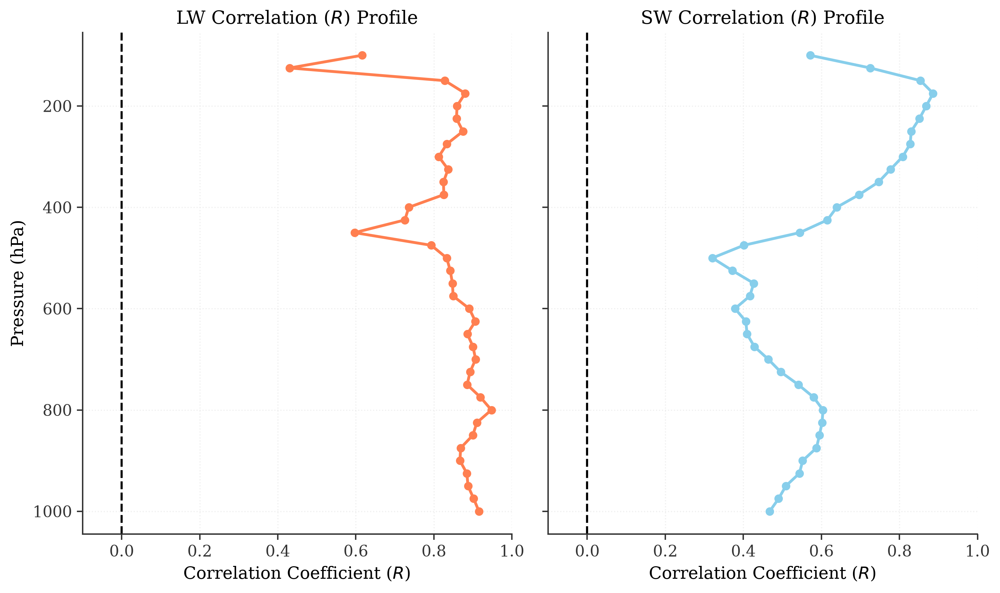
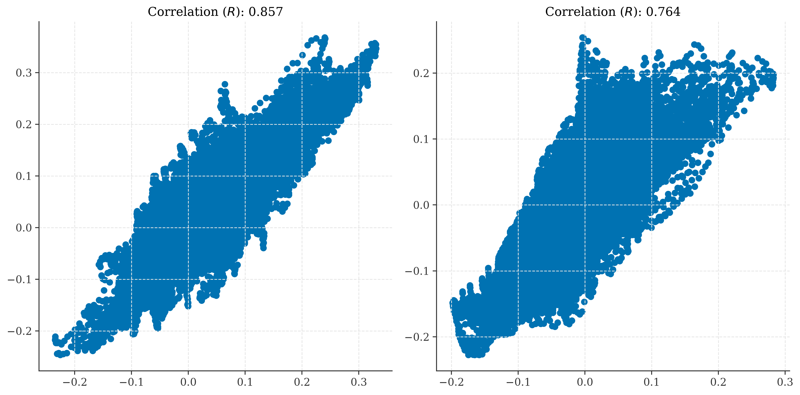
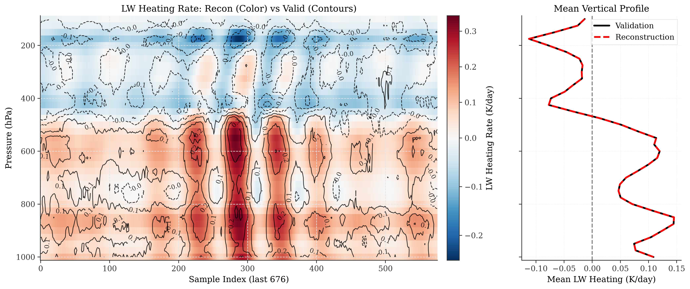
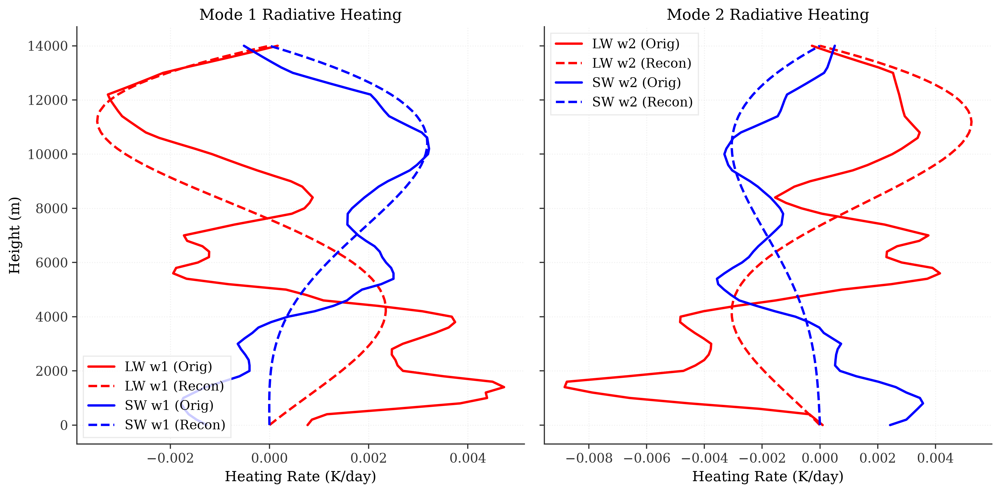
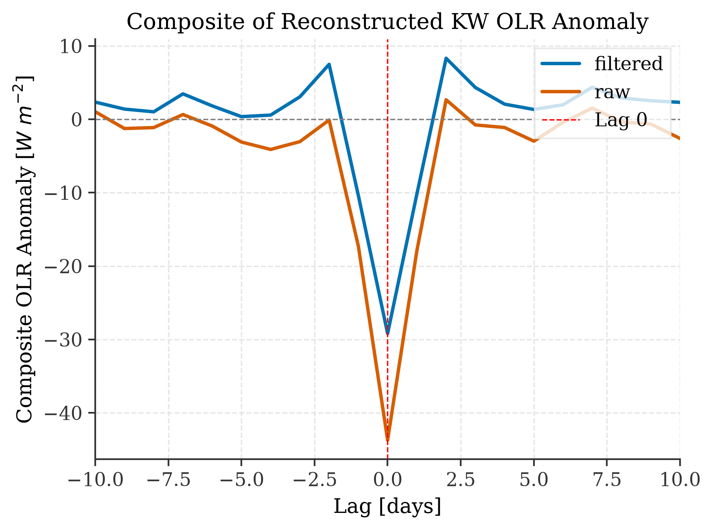
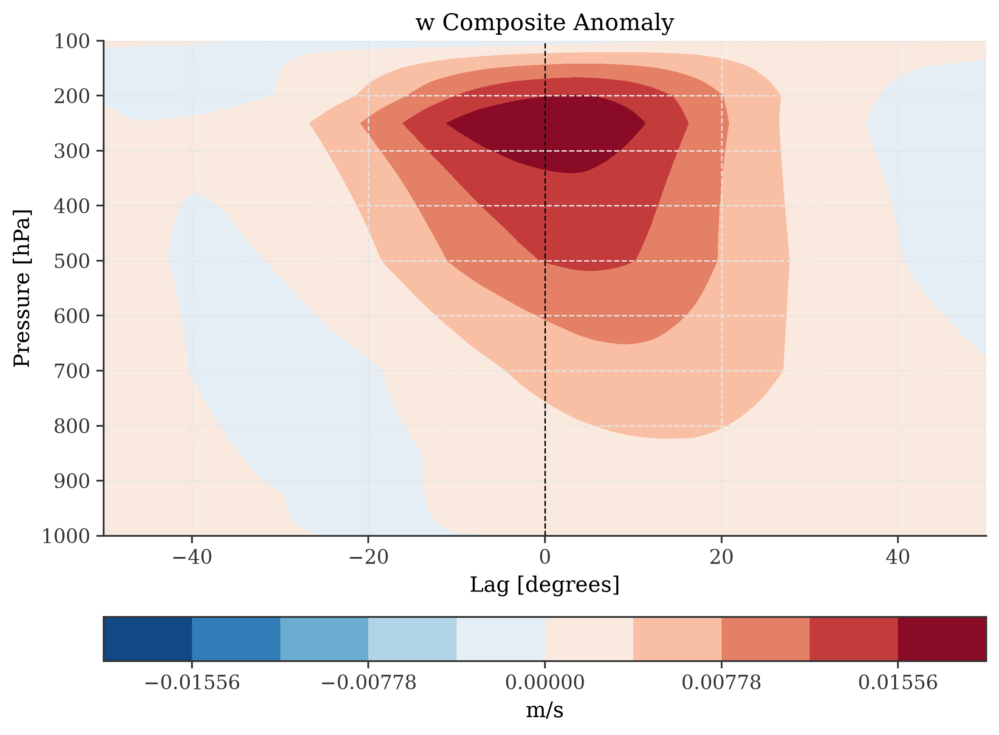
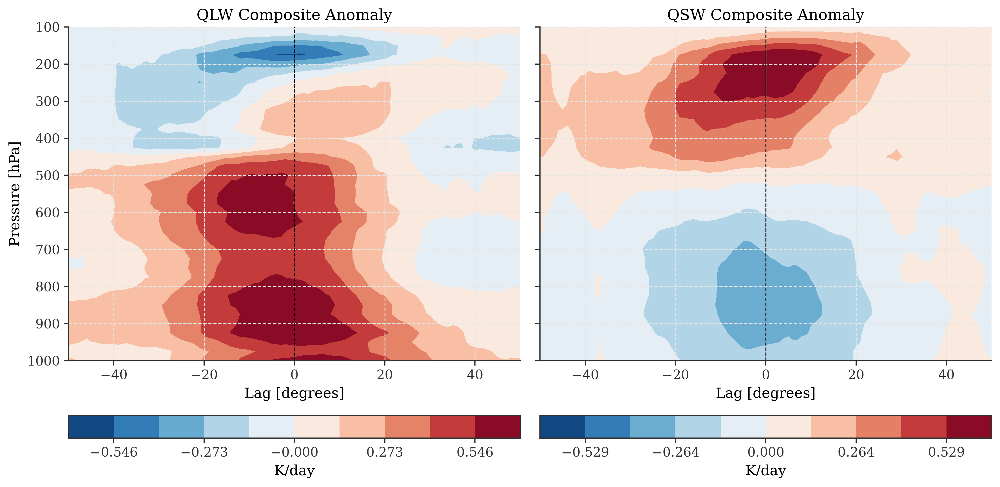

# KW_CloudSat: Kelvin Wave Radiative-Dynamic Coupling Pipeline

## 1. Introduction

The **KW_CloudSat** project is a data analysis pipeline designed to quantify the radiative-dynamic coupling of equatorially trapped Kelvin Waves (KWs). By synthesizing satellite observations and atmospheric reanalysis data, the system extracts the linear transfer function between kinematic vertical motion ($w$) and atmospheric radiative heating rates ($Q_{LW}$, $Q_{SW}$).

To provide a robust evaluation under different signal-to-noise ratios, the pipeline implements two distinct analytical procedures: **Concat** (retaining event-to-event variance) and **Composite** (averaging to isolate the mean wave signal).

## 2. Data Architecture

The pipeline ingests and synthesizes three primary datasets covering the equatorial band (5°S–5°N) for the 2006–2017 period:

*   **Satellite OLR (Outgoing Longwave Radiation):** Acts as the primary signal to filter and identify convectively coupled Kelvin wave events.
*   **ERA5 Reanalysis:** Provides background kinematic data. Pressure velocity ($\omega$) and Temperature ($T$) are ingested to derive physical vertical velocity ($w$).
*   **CloudSat 2B-FLXHR-LIDAR:** Gridded vertical profiles of Longwave ($Q_{LW}$) and Shortwave ($Q_{SW}$) heating rates associated with the KW events.

## 3. Methodology & Pipeline Architecture

The system executes a multi-stage data processing pipeline located in the `Code/` directory.

### Phase 1: Event Identification (`Code/KW_selection.py`)
*   **Filtering:** Symmetrizes OLR data across the equator and applies a Space-Time bandpass filter targeting the theoretical Kelvin wave dispersion curves (equivalent depth $h = 8-90$ m, period $T = 2.5-30$ days).
*   **Triggering:** Uses a 2D minimum filter (7 days $\times$ 31 degrees) to detect local minima. An event is flagged if it passes a $-2.77\sigma$ significance threshold.

### Phase 2: Data Extraction & Preprocessing (`Code/ERA5_composite.py`, `Code/QR_composite.py`)
*   Extracts 3D spatial subsets of ERA5 and CloudSat data corresponding to the identified KW event indices.
*   Performs thermodynamic conversions (e.g., $\omega$ to $w$ via the ideal gas law).
*   Applies a 1D spatial convolution over longitude to smooth the extracted fields.

### Phase 3: Linear Mapping & Regression (`Code/QR_w_Relation.py`)
*   **Objective:** Model radiative heating anomalies as a linear function of vertical motion: $Q' \approx M w'$.
*   **Implementation:** Leverages Partial Least Squares (PLS) regression (n_components=5) to compute the Jacobian matrices ($M_{LW}$ and $M_{SW}$).
*   Splits the data strictly into Training and Validation sets to prevent data leakage.

### Phase 4: Model Prediction & Verification (`Code/Rad_mode_predict.py`, `Code/Rad_mode_verification.py`)
*   Projects the extracted Jacobian matrices onto idealized first and second baroclinic modes to predict idealized radiative responses.
*   Reconstructs spatial heating anomalies on the validation dataset and evaluates the model against the true CloudSat observations.

## 4. Analytical Procedures: Concat vs. Composite

The pipeline can be executed in two distinct modes, controlled via a command-line argument. These modes dictate how the regression model treats the underlying data.

### 4.1. Concat Procedure (`--mode concat`)
*   **Mechanism:** All identified KW events are concatenated along a sequential axis. The PLS regression is trained on the raw, un-averaged timeseries.
*   **Engineering Trade-offs:**
    *   *Pros:* The model is exposed to the full variance of the dataset, including local convective blow-ups, non-linear interactions, and high-frequency weather noise.
    *   *Cons:* The resulting Jacobian matrices ($M$) are inherently noisier. Overall correlation scores ($R^2$) are lower because predicting stochastic noise is difficult, but the model is more representative of raw physical variance.

### 4.2. Composite Procedure (`--mode composite`)
*   **Mechanism:** All KW events are phase-aligned and averaged relative to lag 0. The PLS regression is trained on this single, smoothed "composite" wave footprint.
*   **Engineering Trade-offs:**
    *   *Pros:* Effectively cancels out random convective noise and isolates the "pure" theoretical Kelvin Wave signal. Results in highly accurate reconstructions and clean, deterministic Jacobian matrices.
    *   *Cons:* Over-smooths the dataset. The resulting matrices may overestimate the linear predictability of real-time, individual weather events.

## 5. Execution

The pipeline is orchestrated via a bash script that handles environment variable configuration and module execution.

```bash
# Run the pipeline using the concatenated variance procedure
./Code/run_analysis.sh --mode concat

# Run the pipeline using the smoothed composite procedure
./Code/run_analysis.sh --mode composite
```

## 6. Verification Metrics

System performance is evaluated using the validation dataset against ground-truth CloudSat observations.

*   **Vertical Correlation Profile:** Assesses the Pearson Correlation Coefficient ($R$) as a function of pressure altitude.
    <br>

*   **Global Scatter Verification:** Aggregate scatter plot of reconstructed versus true validation data.
    <br>

*   **Spatial Cross-Section:** Validation truth (contours) overlaid on the model reconstruction (color mesh).
    <br>

*   **Radiative Mode Prediction:** Contrast between empirical basis decomposition and the Jacobian matrix predictions on idealized vertical modes.
    <br>

## 7. System Outputs (Composite Wave Structure)

Sample outputs generated by the pipeline illustrating the core Kelvin Wave composite structure:

*   **OLR Composite Anomaly:**
    <br>
*   **Vertical Motion ($w$) Anomaly:**
    <br>
*   **Radiative Heating ($Q$) Anomalies:**
    <br>
