## Composite Profiles: Vertical Motion (w)

---

## Vertical Motion (w)
### k=1~13

  

---

## Vertical Motion (w)
### k=1~3

  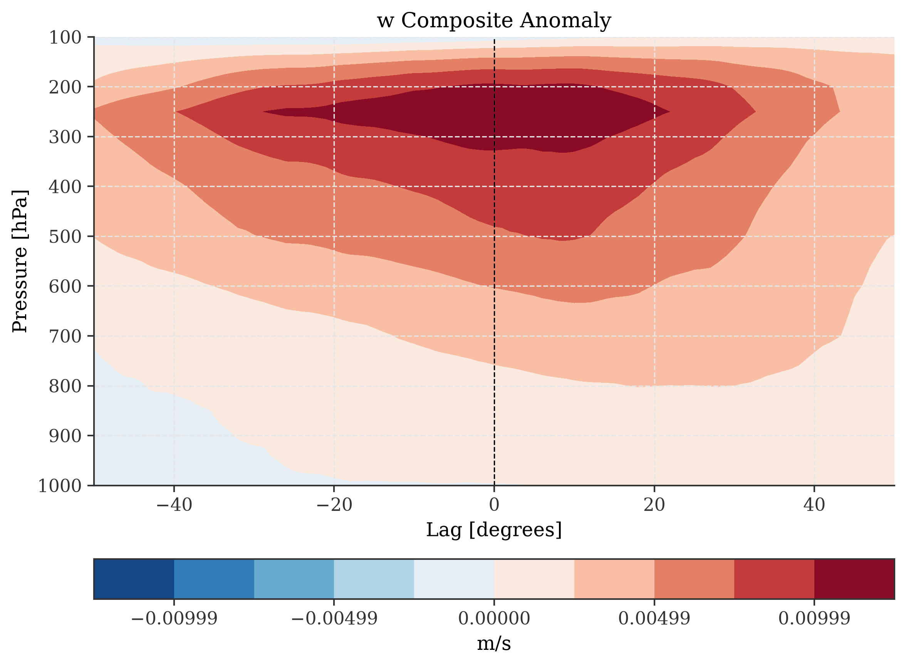

---

## Vertical Motion (w)
### k=3~5

  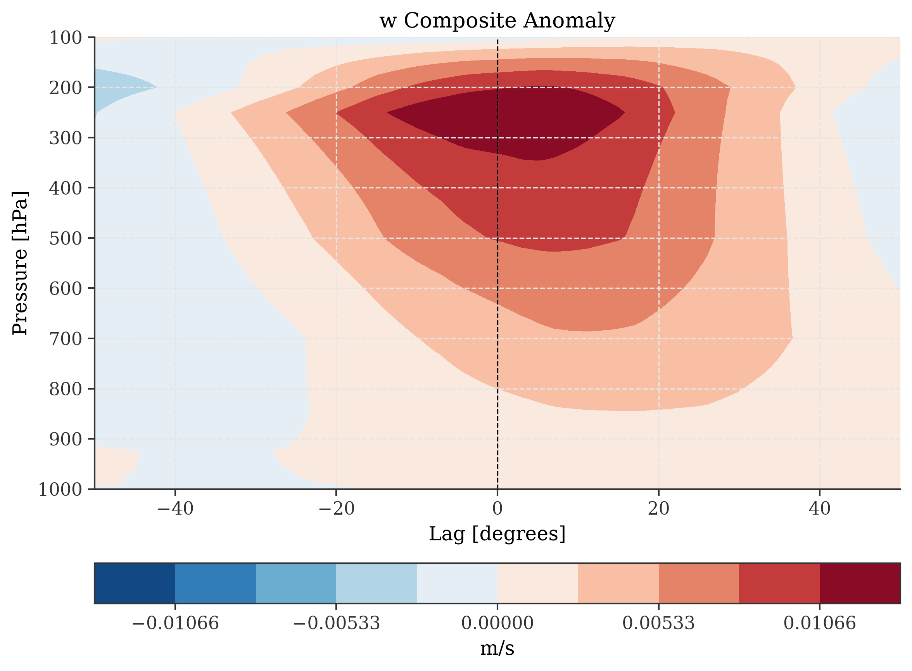

---

## Vertical Motion (w)
### k=5~7

  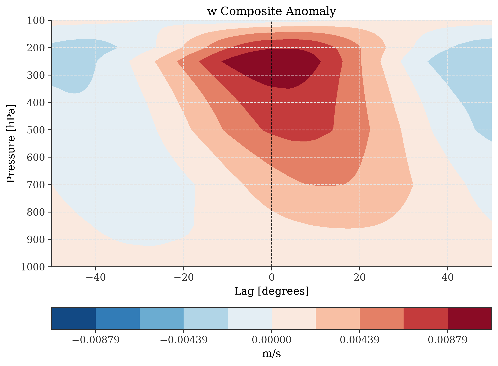

---

## Vertical Motion (w)
### k=7~9

  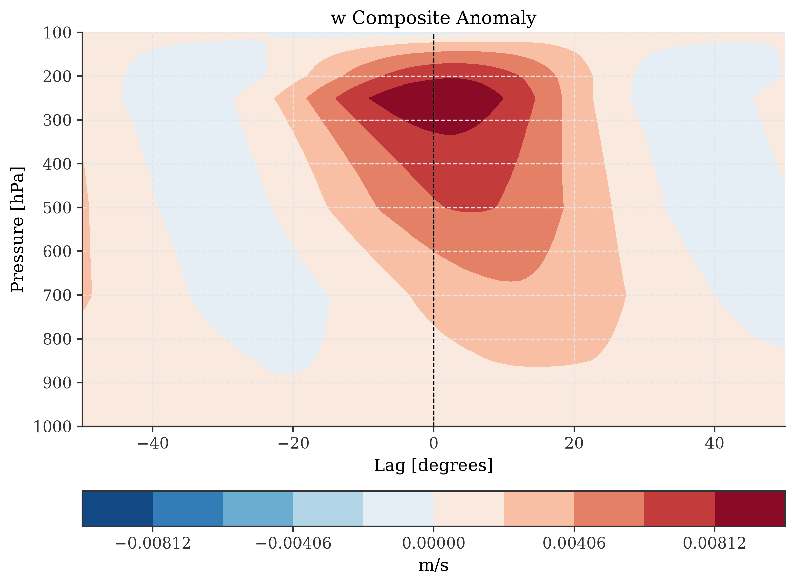

---

## Vertical Motion (w)
### k=9~11

  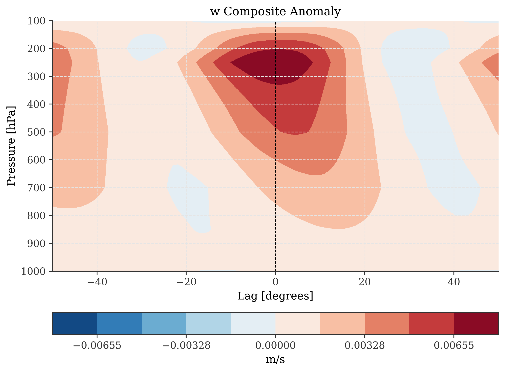

---

## Vertical Motion (w)
### k=11~13

  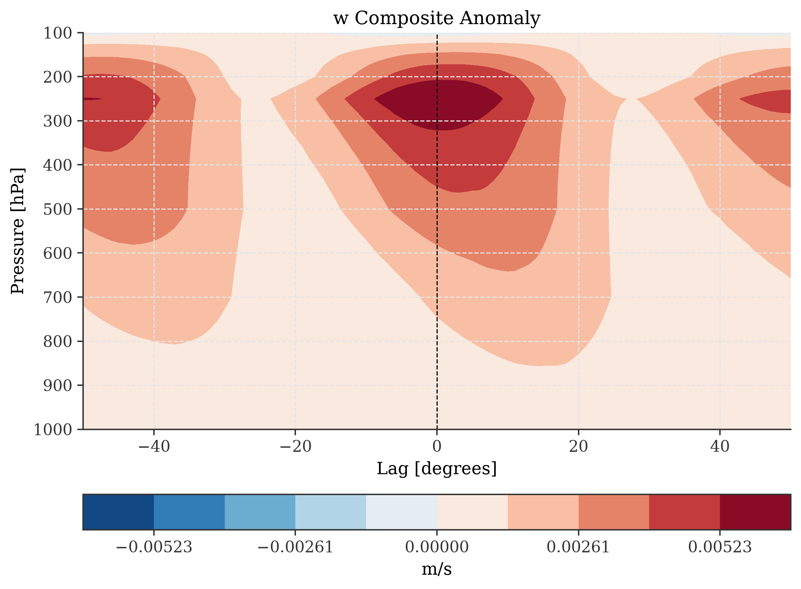

---

## Composite Profiles: Temperature (T)

---

## Temperature (T)
### k=1~13

  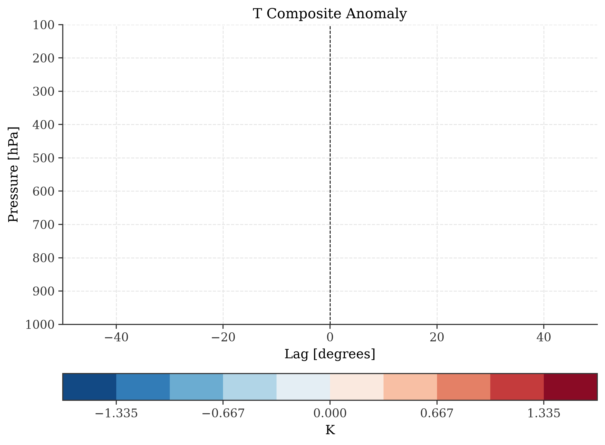

---

## Temperature (T)
### k=1~3

  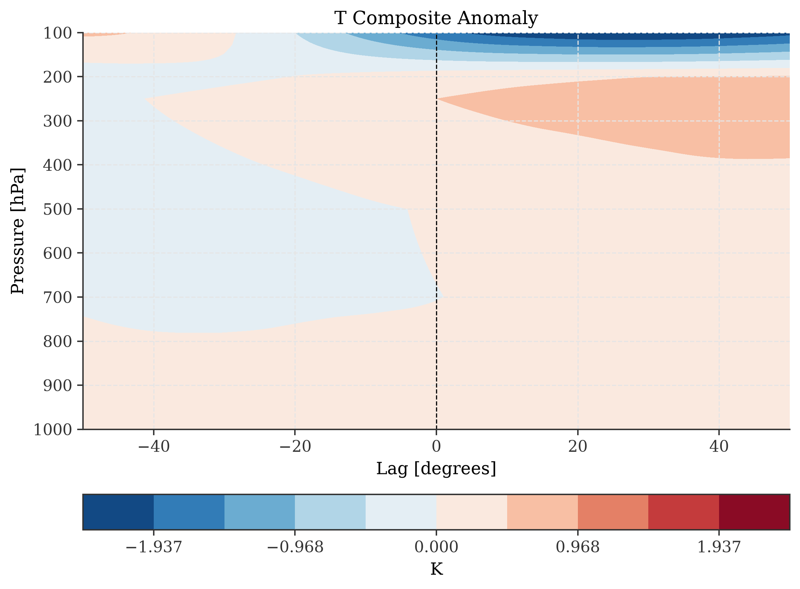

---

## Temperature (T)
### k=3~5

  

---

## Temperature (T)
### k=5~7

  

---

## Temperature (T)
### k=7~9

  

---

## Temperature (T)
### k=9~11

  

---

## Temperature (T)
### k=11~13

  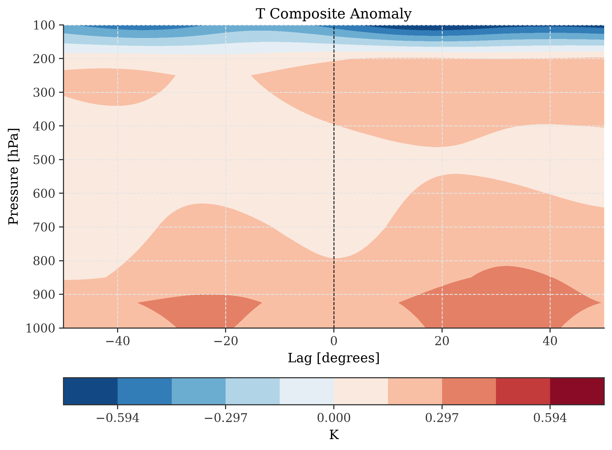

---

## Composite Profiles: Radiative Heating (QR)

---

## Radiative Heating (QR)
### k=1~13

  

---

## Radiative Heating (QR)
### k=1~3

  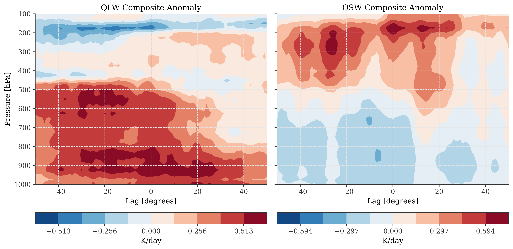

---

## Radiative Heating (QR)
### k=3~5

  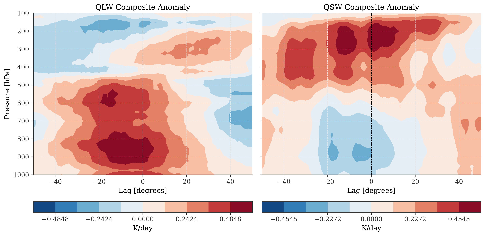

---

## Radiative Heating (QR)
### k=5~7

  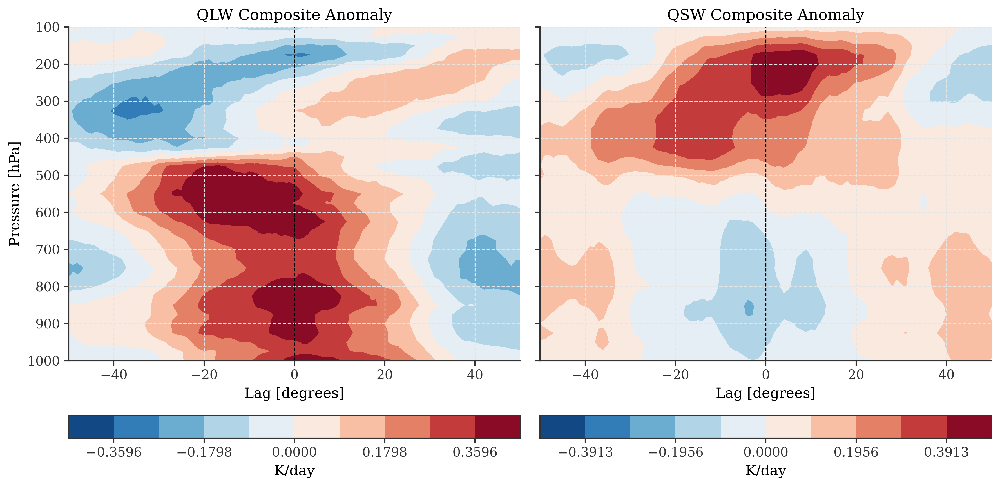

---

## Radiative Heating (QR)
### k=7~9

  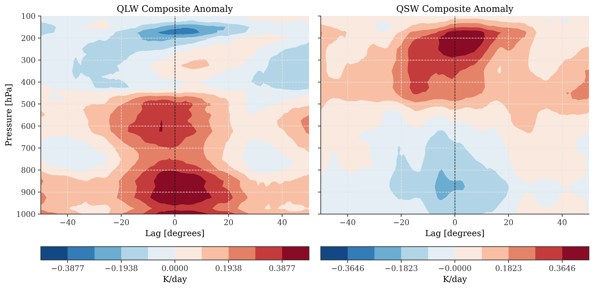

---

## Radiative Heating (QR)
### k=9~11

  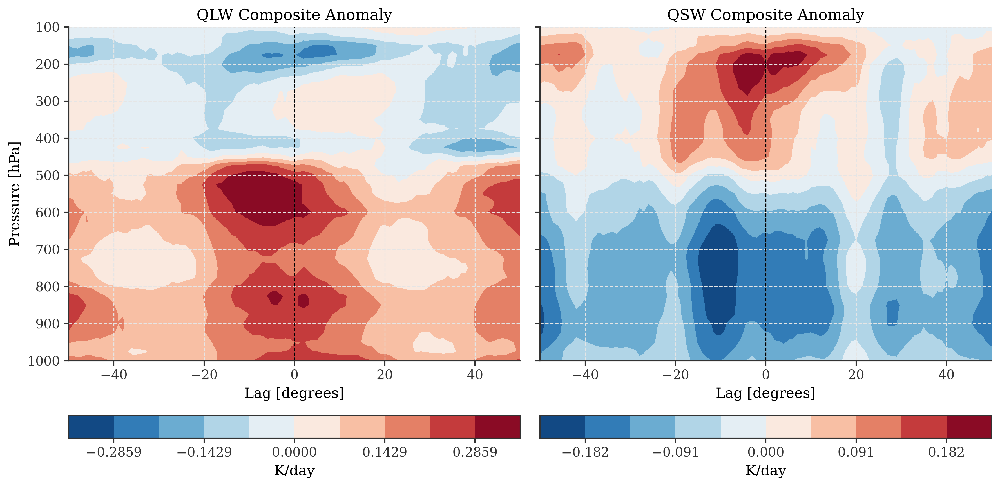

---

## Radiative Heating (QR)
### k=11~13

  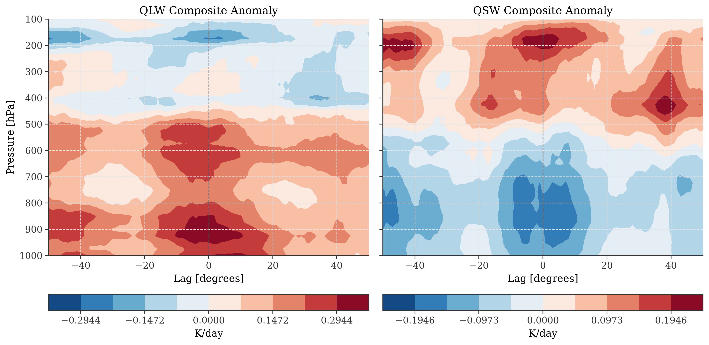

